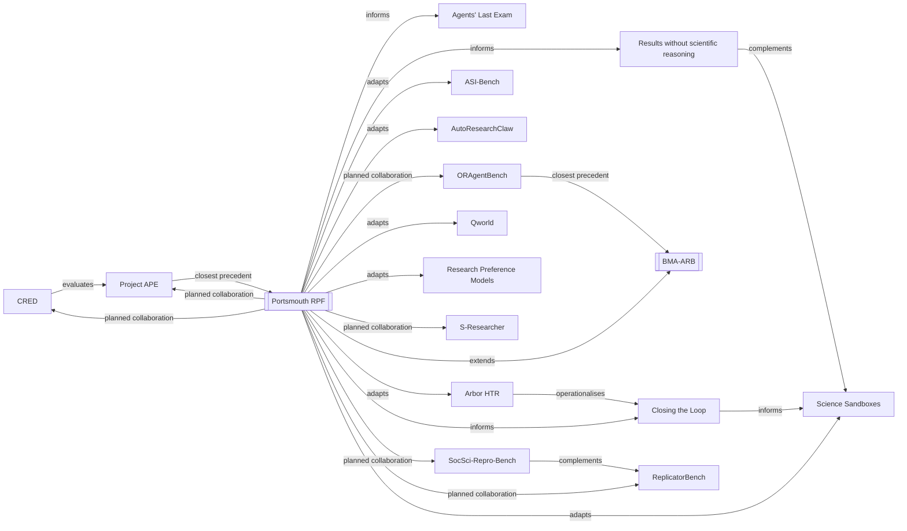

<!-- Generated by scripts/render_genealogy.py. Edit the JSON/JSONL sources, not this file. -->

# Living AI-research benchmark genealogy

**Evidence checked:** 2026-09-03

The curated graph contains **34 nodes**, **45 relationships** and **8 collaboration targets**. The discovery queue contains **0 candidate records**.

## Portsmouth research production function

The Portsmouth programme extends BMA-ARB from autonomous capability measurement to a costed research production function. It will estimate the number of journal-ready outputs produced by combinations of human effort, compute, orchestration and verification, weighted to Portsmouth's observed business and management portfolio. Released academic time is a resource benefit. Owned GPUs remain an optional comparator rather than a presumed requirement.

### Contribution boundary

| Existing capability | Closest prior work | Portsmouth addition |
| --- | --- | --- |
| Autonomous public-data social-science papers | Project APE | Blinded journal-readiness review, academic-time logging and actual-portfolio weighting |
| Costed defect detection in executable papers | CRED | Business and management validity domains plus total production and rework cost |
| Progressive removal of human guidance | ASI-Bench | Price each guidance condition and retain journal-ready output as the outcome |
| End-to-end social-science replication | ReplicatorBench and SocSci-Repro-Bench | Production of new articles and substitution at research-work-package level |
| Scientific induction under hidden rules | Science Sandboxes and DiscoverPhysics | Organisational dry/damp worlds linked to real paper-production trials |
| Research-compute allocation | AI Research Preference Models | Minimise resource cost per journal-ready business and management output |
| Economically valuable agent work | Agents' Last Exam | University research production, released academic capacity and infrastructure choice |

## Portfolio evidence currently available

The privacy-safe profile contains **277** candidate UOA17 outputs. Journal enrichment status is **not yet enriched**. Title signals overlap and are used only as provisional coverage checks.

| Title-level signal | Outputs | Share |
| --- | ---: | ---: |
| quantitative or effect | 46 | 16.6% |
| policy documentary historical | 42 | 15.2% |
| digital text data | 28 | 10.1% |
| conceptual or theory | 15 | 5.4% |
| evidence synthesis | 11 | 4.0% |
| formal or computational | 8 | 2.9% |
| qualitative or case | 3 | 1.1% |
| no explicit design signal | 147 | 53.1% |

The current source does not contain journal title or ISSN. The production benchmark will therefore remain unweighted by journal until an authorised public-metadata join is completed. It must not infer CABS or journal tiers from titles.

## Collaboration route

| Priority | Target | Proposed joint work | First contact objective |
| ---: | --- | --- | --- |
| 1 | [Project APE](https://ape.socialcatalystlab.org/) | Create a business and management extension that reuses APE's public-data paper-production corpus and execution conventions while Portsmouth supplies journal-readiness review, academic-time logging and portfolio weighting. | Discuss access to the APE paper/run schema, limits of the tournament judge and a jointly specified two-paper pilot. |
| 2 | [CRED: Cost-Recall Evaluation of Defect Detectors](https://ape.socialcatalystlab.org/cred/verifying-the-verifiers.pdf) | Adapt CRED's defect taxonomy and cost-recall machinery to business and management papers, adding construct validity, identification and theory-evidence alignment as separately adjudicated domains. | Request the current CRED codebook, injected-error generator and verifier result schema; agree what can be reused without implying journal quality. |
| 3 | [ReplicatorBench](https://arxiv.org/abs/2602.11354) | Share social and behavioural replication tasks as low-risk production-function cases and compare human-only, protocol-specified and method-autonomous conditions. | Identify two business or management compatible cases with public or redistributable inputs. |
| 4 | [ASI-Bench](https://arxiv.org/abs/2608.17271) | Reuse the progressive guidance-withdrawal design while recording academic minutes, model cost, rework and journal-readiness outcomes. | Align guidance-condition definitions and discuss cross-benchmark reporting. |
| 5 | [Science Sandboxes](https://arxiv.org/abs/2608.30165) | Co-design a dry and damp organisational sandbox in which agents must distinguish prediction, causal identification and theory recovery. | Agree the minimal specimen-assay-oracle interface for an organisational research world. |
| 6 | [AI Research Preference Models](https://arxiv.org/abs/2608.13940) | Test whether pairwise research-branch selection and pilot experiments reduce cost per journal-ready business paper relative to more inference or more rollouts. | Share a candidate-action schema and identify the smallest inference-only RPM comparison. |
| 7 | [Qworld](https://arxiv.org/abs/2603.23522) | Adapt question-specific criteria into blinded reviewer packs calibrated to journals represented in Portsmouth's actual portfolio. | Compare criterion-generation outputs with two academic reviewers on one paper challenge. |
| 8 | [AutoResearchClaw](https://arxiv.org/abs/2605.20025) | Replicate the seven human-intervention modes on business and management article production, replacing generic human involvement with timed academic work packages. | Obtain exact intervention definitions and run-ledger fields. |

## Key relationship graph

## Curated registry

| Work | Year | Kind | Evaluation unit | Human guidance | Human time reported | Monetary cost reported | Journal floor | Portsmouth relevance |
| --- | ---: | --- | --- | --- | --- | --- | --- | ---: |
| [Agents' Last Exam](https://arxiv.org/abs/2606.05405) | 2026 | benchmark | professional task | autonomous | no | no | no | 5 |
| [AI Research Preference Models](https://arxiv.org/abs/2608.13940) | 2026 | method | candidate branch | autonomous | no | no | no | 5 |
| [AI Scientists Produce Results Without Reasoning Scientifically](https://arxiv.org/abs/2604.18805) | 2026 | benchmark | trajectory | autonomous | no | no | no | 5 |
| [Arbor: Hypothesis-Tree Research](https://arxiv.org/abs/2606.11926) | 2026 | system | trajectory | mixed | no | no | no | 5 |
| [ASI-Bench](https://arxiv.org/abs/2608.17271) | 2026 | benchmark | project task | progressively withdrawn | no | no | no | 5 |
| [AutoResearchClaw](https://arxiv.org/abs/2605.20025) | 2026 | system | workflow | mixed | no | no | no | 5 |
| [AutoResearchEval](https://arxiv.org/abs/2608.14905) | 2026 | benchmark | trajectory | autonomous | no | no | no | 5 |
| [Business and Management Autonomous Research Benchmark (BMA-ARB)](https://github.com/NigelWilliamUOP/BusinessArticleBenchmark) | 2026 | benchmark | paper | autonomous | no | no | no | 5 |
| [Closing the Loop in AI-Driven Biomedical Discovery](https://doi.org/10.20944/preprints202608.2107.v1) | 2026 | review | trajectory | human on loop | no | no | no | 5 |
| [CRED: Cost-Recall Evaluation of Defect Detectors](https://ape.socialcatalystlab.org/cred/verifying-the-verifiers.pdf) | 2026 | benchmark | claim | mixed | yes | yes | no | 5 |
| [ORAgentBench](https://arxiv.org/abs/2606.19787) | 2026 | benchmark | project task | autonomous | no | no | no | 5 |
| [Portsmouth Business School Research Production Frontier](https://github.com/NigelWilliamUOP/BusinessArticleBenchmark/tree/main/genealogy) | 2026 | local_program | institutional portfolio | progressively withdrawn | yes | yes | yes | 5 |
| [Project APE](https://ape.socialcatalystlab.org/) | 2026 | project | paper | autonomous | no | no | no | 5 |
| [Qworld](https://arxiv.org/abs/2603.23522) | 2026 | method | claim | mixed | no | no | no | 5 |
| [ReplicatorBench](https://arxiv.org/abs/2602.11354) | 2026 | benchmark | workflow | protocol specified | no | no | no | 5 |
| [S-Researcher](https://arxiv.org/abs/2604.01520) | 2026 | system | workflow | human in loop | no | no | no | 5 |
| [Science Sandboxes](https://arxiv.org/abs/2608.30165) | 2026 | framework | simulation world | autonomous | no | no | no | 5 |
| [SocSci-Repro-Bench](https://arxiv.org/abs/2606.11447) | 2026 | benchmark | workflow | protocol specified | no | no | no | 5 |
| [The Verification Gap in AI-Generated Research](https://arxiv.org/abs/2608.05179) | 2026 | review | none | not applicable | no | no | no | 5 |
| [CORE-Bench](https://arxiv.org/abs/2409.11363) | 2024 | benchmark | workflow | protocol specified | no | no | no | 4 |
| [PaperBench](https://arxiv.org/abs/2504.01848) | 2025 | benchmark | paper | protocol specified | no | no | no | 4 |
| [AutoResearchBench](https://arxiv.org/abs/2604.25256) | 2026 | benchmark | project task | autonomous | no | no | no | 4 |
| [DiscoverPhysics](https://arxiv.org/abs/2605.26087) | 2026 | benchmark | simulation world | autonomous | no | no | no | 4 |
| [FIRE-Bench](https://arxiv.org/abs/2602.02905) | 2026 | benchmark | workflow | autonomous | no | no | no | 4 |
| [HeurekaBench](https://arxiv.org/abs/2601.01678) | 2026 | benchmark | project task | protocol specified | no | no | no | 4 |
| [MARS: Modular Agent with Reflective Search for Automated AI Research](https://arxiv.org/abs/2602.02660) | 2026 | system | project task | autonomous | no | no | no | 4 |
| [NatureBench](https://arxiv.org/abs/2606.24530) | 2026 | benchmark | project task | autonomous | no | no | no | 4 |
| [PhysGym](https://arxiv.org/abs/2507.15550) | 2026 | benchmark | simulation world | autonomous | no | no | no | 4 |
| [ResearchClawBench](https://arxiv.org/abs/2606.07591) | 2026 | benchmark | project task | autonomous | no | no | no | 4 |
| [The AI Scientist: Towards Fully Automated Open-Ended Scientific Discovery](https://arxiv.org/abs/2408.06292) | 2024 | system | paper | autonomous | no | yes | no | 3 |
| [AIRA-dojo](https://openreview.net/forum?id=RwfrdKSgCE) | 2025 | system | project task | autonomous | no | no | no | 3 |
| [The AI Scientist-v2: Workshop-Level Automated Scientific Discovery via Agentic Tree Search](https://arxiv.org/abs/2504.08066) | 2025 | system | paper | autonomous | no | no | no | 3 |
| [AIRA2](https://arxiv.org/abs/2603.26499) | 2026 | system | project task | autonomous | no | no | no | 3 |
| [AIRS-Bench](https://arxiv.org/abs/2602.06855) | 2026 | benchmark | project task | autonomous | no | no | no | 3 |

## Registry composition

| Dimension | Counts |
| --- | --- |
| Kind | benchmark: 19, framework: 1, local_program: 1, method: 2, project: 1, review: 2, system: 8 |
| Status | active: 4, local_design: 1, preprint: 25, published: 4 |

## Candidate queue

No automatically discovered candidates are awaiting review.

## Maintenance rule

Automated discovery can append candidates but cannot amend curated nodes or relationships. Promotion requires review of a primary source, a claim boundary and at least one supported relationship. Historic records are versioned rather than silently overwritten.
